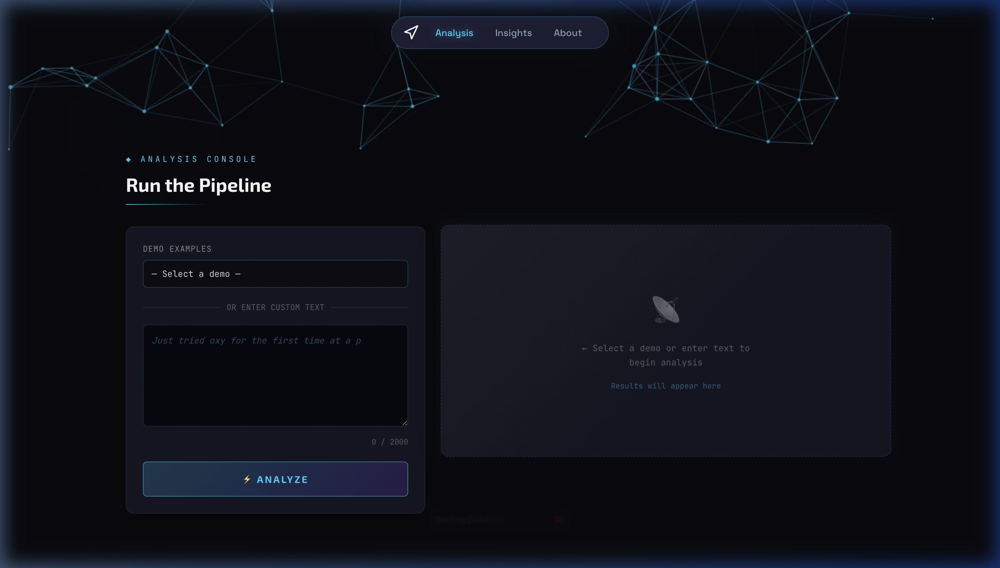

# SIGNAL - Addictive Narrative Intelligence 🧠🎙️

[](https://fastapi.tiangolo.com/)
[](https://www.docker.com/)
[](https://deepmind.google/technologies/gemini/)
[](https://www.python.org/)

**Substance Intelligence through Grounded Narrative Analysis of Language**

SIGNAL is an advanced natural language processing pipeline and web application designed to automatically classify, analyze, and ground social media discussions about substance use. Originally conceived as a competitive solution for the AI for Substance Abuse Risk Detection challenge, it maps out the complex narrative arcs of addiction—from initial curiosity to severe crisis to recovery—using state-of-the-art language models and hard clinical evidence.

---

## 📖 What This Project Does

SIGNAL takes raw unstructured text (e.g., from Reddit or clinical forums) and processes it through a sophisticated **4-Layer Architecture** to produce evidence-cited, clinical-grade analyst briefs for public health monitoring.



### The 4-Layer Architecture:
1. **Substance Resolution**: Intelligently resolves street slang and informal drug names to their exact clinical equivalents utilizing an ensemble of rule-based lexicons, SBERT embeddings, and Gemini LLMs.
2. **Narrative Stage Classification**: Analyzes the contextual arc of the user's post to classify the author's state into one of 6 clinical addiction stages (see below).
3. **Clinical Grounding**: Takes the resolved substances and retrieves rich pharmacological data from FAERS (FDA Adverse Event Reporting System), knowledge indices, and drug safety labels via a FAISS + BM25 engine.
4. **Brief Synthesis**: Synthesizes the extracted entities, classification, and grounded evidence into a structured, highly-readable Analyst Brief using Google's Gemini models.

---

## 📊 The 6 Narrative Stages

Unlike basic binary detection classifiers, SIGNAL identifies exactly where a user sits in the addiction journey:

| Stage | Description | Key Indicators |
|---|---|---|
| **1. Curiosity** | Pre-use interest, questions about a substance | *"What does X feel like?", "Is it safe to..."* |
| **2. Experimentation** | First or early use, primarily recreational | *"Tried it last weekend", "Not addicted, just fun"* |
| **3. Regular Use** | Patterned use, functional framing | *"I use every Friday", "helps me deal with..."* |
| **4. Dependence** | Compulsive use, withdrawal symptoms | *"Can't function without", "sick when I stop"* |
| **5. Crisis** | Overdose, severe consequences, extreme risk | *"Overdosed last night", "lost my job/family"* |
| **6. Recovery** | Treatment, sobriety maintenance, healing | *"30 days clean", "in treatment", "sober"* |

---

## 🛠 Tech Stack

- **Core/API**: Python 3.11, FastAPI, Uvicorn
- **AI / Foundational Models**: Google Gemini 2.5 Flash / Gemini 2.0 (via Vertex AI), DistilBERT (fine-tuned)
- **Vector Search / Retrieval**: FAISS (`faiss-cpu`), `rank_bm25`, Vertex AI `text-embedding-004` (fallback to `all-MiniLM-L6-v2`)
- **Deployment**: Fully containerized using Docker
- **Testing & Data**: `pytest`, HuggingFace `datasets`

---

## 🚀 Getting Started

We have completely dockerized the application to rely on standard volume mounting instead of copying heavy ML models and cache dependencies into the container image. This keeps the setup lean and blazing fast.

### Prerequisites
- [Docker & Docker Desktop](https://www.docker.com/products/docker-desktop/) installed and running.
- Local data dependencies (The project expects specific dataset folders like `cache`, `models`, `opioid_data` to exist within the project root).

### Running The App

**1. Clone the repo & navigate to the folder:**
```bash
git clone <repository_url>
cd SIGNAL
```

**2. Build the Docker Image:**
```bash
docker build -t signal-app .
```

**3. Run the container and mount your data directories:**
```bash
docker run --name signal-api --rm -p 8000:8000 \
  -v $(pwd)/cache:/app/cache \
  -v $(pwd)/models:/app/models \
  -v $(pwd)/opioid_data:/app/opioid_data \
  -v $(pwd)/evidence:/app/evidence \
  signal-app
```
*(You can append `-d` after `run` to start the app in disconnected background mode).*

**4. Access the API & Dashboard:**
The FastAPI server will now be listening on port 8000. You can investigate endpoints via `http://localhost:8000/docs` (Swagger UI).

---

## 🤝 Contributing & Maintenance

If you wish to augment the pipeline (for instance, adding classification modules for new substances like cannabinoids or general stimulants), please check out the `signal/config.py` routines. All prompts, weighting models, and classification constraints are designed to be easily extensible. 

To run local tests across the evaluation pipeline:
```bash
pytest signal/tests/
```

> **Note**: For local development without Docker, ensure you have set up a `.venv`, installed `requirements.txt`, and populated the `GOOGLE_APPLICATION_CREDENTIALS` context variables accordingly.

---
*Built with ❤️ to intercept the opioid crisis with actionable data.*
